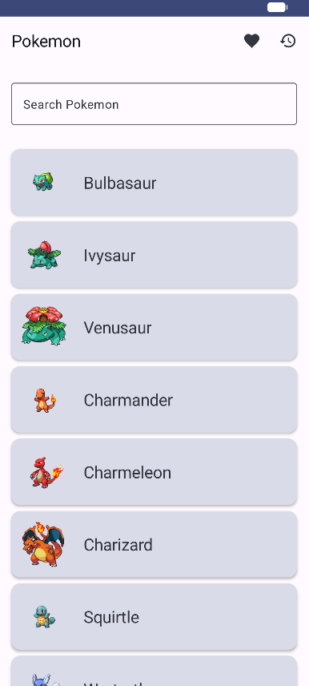
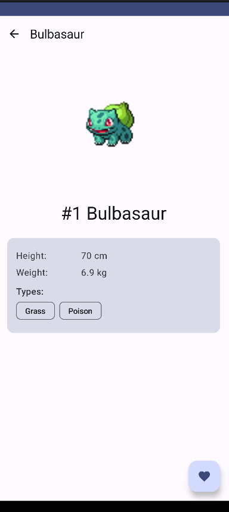
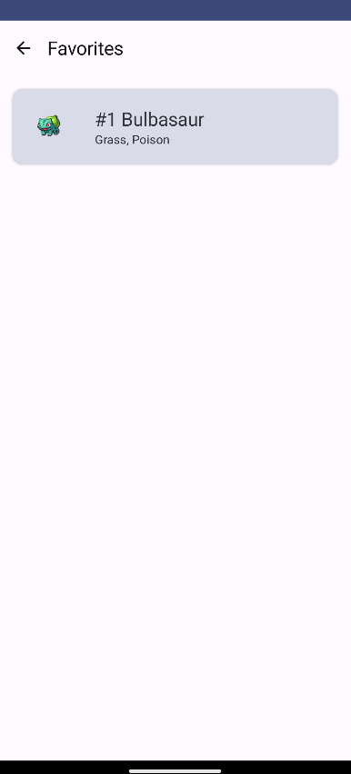
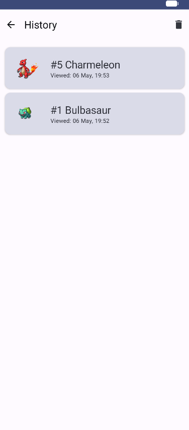
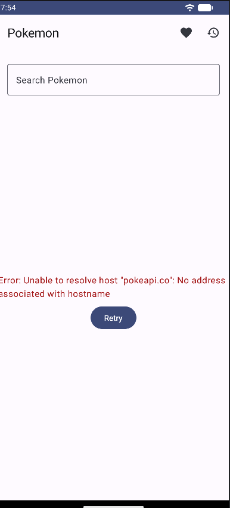

ФИО: Пелих Дмитрий Александрович
Группа: Б9123-09.03.03

Выбранный API:
PokeAPI (https://pokeapi.co/). Открытый API, не требует ключа. Используется для получения списка покемонов и детальной информации.

Что сделано в ДЗ №4:

+ Добавлен Hilt — DI через @HiltAndroidApp, @AndroidEntryPoint, @HiltViewModel. Модули NetworkModule и DatabaseModule раздают Retrofit, Repository, AppDatabase, DAO.
+ Добавлен Room (база pokemon.db, версия 1) — две таблицы: favorites и history.
+ favorites — записи добавляются по сердечку на Detail, удаляются повторным нажатием, переживают перезапуск.
+ history — пишется при каждом открытии Detail (REPLACE по id), отображается на отдельном экране в обратном порядке по времени, есть кнопка очистки.

Чеклист требований ТЗ:

+ Hilt: DI подключён на Application, MainActivity, ViewModel. В UI и VM нет new или object для зависимостей.
+ Room: 2 таблицы (favorites, history), реально используются — favorites переживает перезапуск, history пишется при каждом открытии Detail.
+ Базовый проект из ДЗ №3 рабочий: 4 экрана через Navigation Compose, Retrofit + coroutines, UI-состояния Loading / Error+Retry / Empty / Success.

Стек:

Kotlin 1.9.20, AGP 8.2.0, KSP, Compose Material3, Navigation Compose 2.7.6, Hilt 2.50, Room 2.6.1, Retrofit 2.9.0, Coil 2.5.0. minSdk 24, targetSdk 34, compileSdk 34.

Скриншоты:

